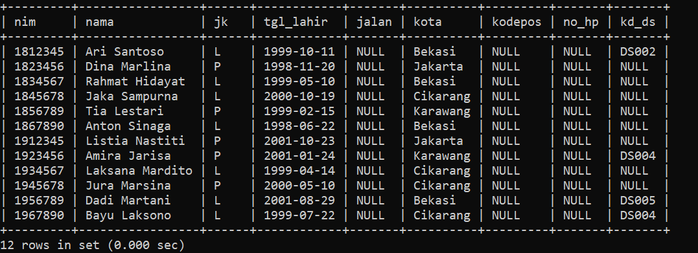
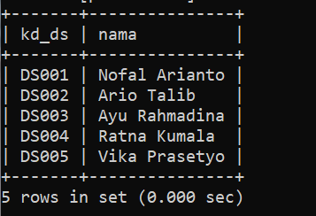
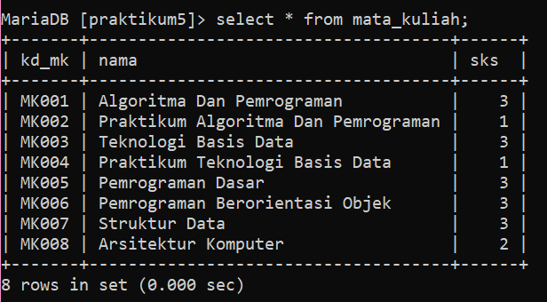
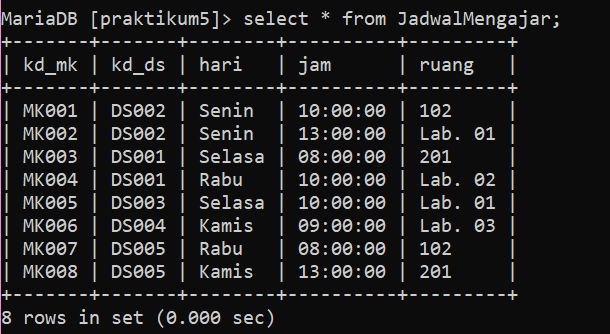
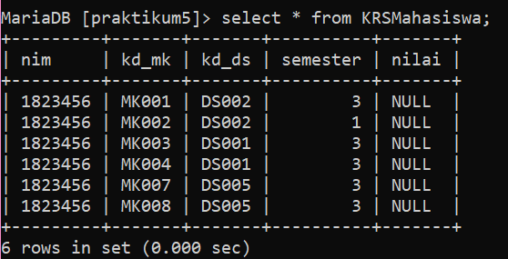
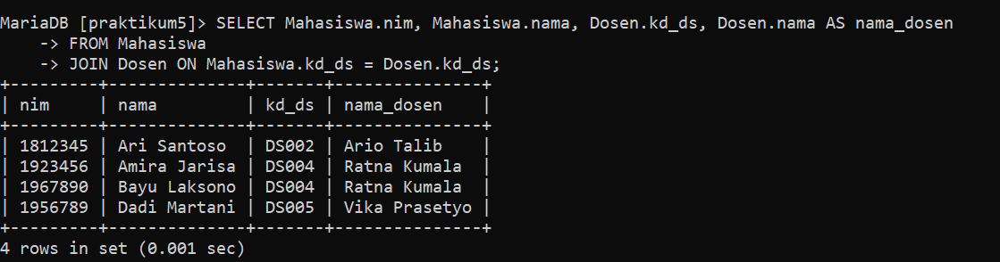
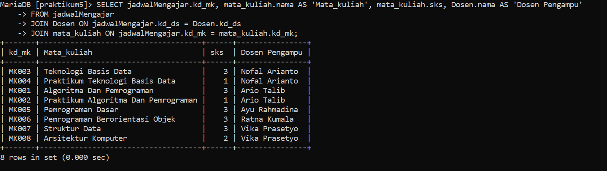
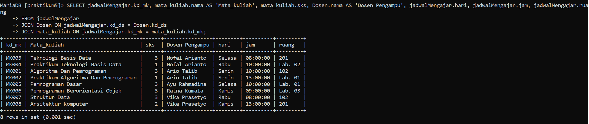
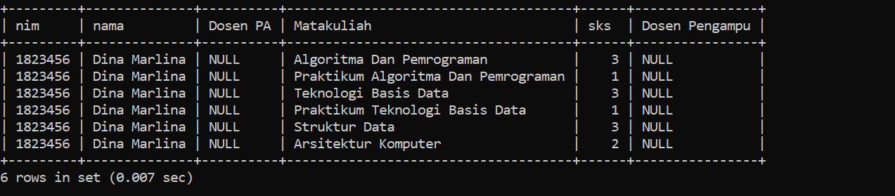
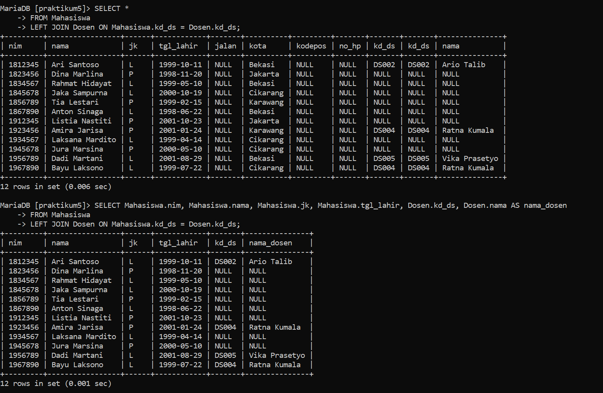

# praktikum5
# Basis-data-praktikum-5

```
Latihan
1 Lakukan join table Mahasiswa dan Dosen
2 Lakukan join tabel Matakuliah dan Dosen
3 Lakukan join table JadwalMengajar, Dosen, dan Matakuluan
4 Lakukan join tabel KrsMahasiswa, Mahasiswa, Matakuliah, dan Dosen
```


* PERTAMA KITA BUAT DULU TABELNYA :
### Tabel Mahasiswa


### Tabel Dosen


### Tabel mata_kuliah


### Tabel JadwalMengajar


### Tabel KRSMahasiswa



* KEMUDIAN MENGAPLIKASIKAN PERINTAH LATIHAN YANG TELAH DIBERIKAN :

# LATIHAN

1 Lakukan join table Mahasiswa dan Dosen



2 Lakukan join tabel Matakuliah dan Dosen
c
```
Pada kode ini hasilnya eror karena tidak ada relasi antara kedua tabel. tabel dosen memiliki kolom kd_ds sementara tabel mata_kuliah tidak. table mata_kuliah memiliki kolom kd_mk sementara tabel dosen tidak. intinya tidak ada forign key yang sama sehingga tidak bisa saling berelasi.
```


3 Lakukan join table JadwalMengajar, Dosen, dan Matakuluan





4 Lakukan join tabel KrsMahasiswa, Mahasiswa, Matakuliah, dan Dosen


# LATIHAN

1. JOIN table Mahasiswa dan Dosen
```
SELECT Mahasiswa.nim, Mahasiswa.nama, Mahasiswa.jenis_kelamin, Dosen.nama AS 'Dosen' 
FROM Mahasiswa 
JOIN Dosen ON Dosen.kd_ds=Mahasiswa.kd_ds;
```


2. LEFT JOIN table Mahasiswa dan Dosen
```
SELECT Mahasiswa.nim, Mahasiswa.nama, Mahasiswa.jenis_kelamin, Dosen.nama AS 'Dosen'
FROM Mahasiswa
LEFT JOIN Dosen ON Dosen.kd_ds=Mahasiswa.kd_ds;
```



3. JOIN table JadwalMengajar, Dosen, dan Matakuliah
```
SELECT jadwalMengajar.kd_mk, matakuliah.nama AS 'Mata kuliah', matakuliah.sks, Dosen.nama AS 'Dosen Pengampu'
FROM jadwalMengajar
JOIN Dosen ON jadwalMengajar.kd_ds = Dosen.kd_ds
JOIN matakuliah ON jadwalMengajar.kd_mk = matakuliah.kd_mk;
```


4. JOIN table JadwalMengajar, Dosen, dan Matakuliah
```
SELECT krsmahasiswa.nim, mahasiswa.nama, dosen_pa.nama AS 'Dosen PA', mata_kuliah.nama AS 'Matakuliah', mata_kuliah.sks, dosen_pengampu.nama AS 'Dosen Pengampu'
FROM krsmahasiswa
JOIN mahasiswa ON krsmahasiswa.nim = mahasiswa.nim
JOIN mata_kuliah ON krsmahasiswa.kd_mk = mata_kuliah.kd_mk
LEFT JOIN dosen AS dosen_pa ON mahasiswa.kd_ds = dosen_pa.kd_ds
LEFT JOIN dosen AS dosen_pengampu ON mata_kuliah.kd_ds = dosen_pengampu.kd_ds;

```


```
Ada beberapa kemungkinan penyebab mengapa nilai kolom 'dosen_pa' dan 'dosen_pengampu' tetap null setelah menjalankan perintah UPDATE. Berikut adalah beberapa kemungkinan penyebabnya:

Data yang tidak cocok: Periksa apakah ada kesalahan dalam pemetaan antara tabel 'krsmahasiswa', 'mahasiswa', 'mata_kuliah', dan 'dosen'. Pastikan kolom yang digunakan dalam JOIN dan kondisi WHERE sesuai dengan struktur tabel dan nilai yang ada.

Referensi yang hilang: Pastikan bahwa kolom 'kd_ds' di tabel 'mahasiswa' dan 'mata_kuliah' merujuk ke kolom 'kd_ds' di tabel 'dosen'. Jika tidak ada referensi yang cocok, maka nilainya akan tetap null.

Data yang belum diisi: Periksa apakah ada data yang belum diisi pada kolom 'kd_ds' di tabel 'mahasiswa' dan 'mata_kuliah'. Jika kolom 'kd_ds' kosong, maka nilai 'dosen_pa' dan 'dosen_pengampu' akan tetap null.

Penulisan sintaks SQL yang salah: Pastikan bahwa sintaks SQL yang digunakan dalam perintah UPDATE dan JOIN sudah benar. Periksa tanda kutip, titik, dan penulisan nama tabel dan kolom dengan tepat.

Dengan memeriksa kemungkinan-kemungkinan di atas dan memeriksa kembali data Anda, Anda dapat mengidentifikasi penyebab nilai null dan memperbaikinya.
```


